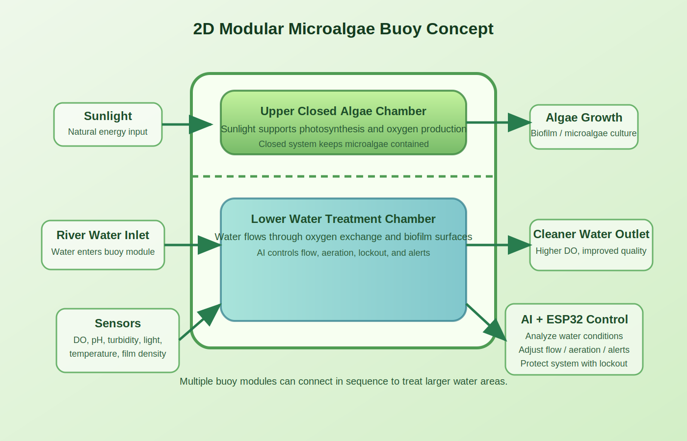
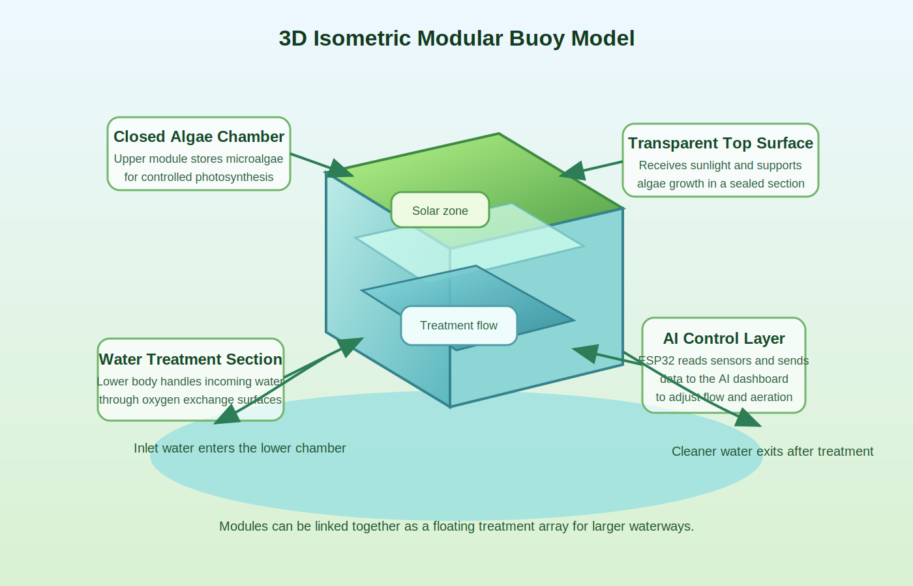

# Liquid3-Inspired Microalgae Water Buoy

A high-school project for a floating water-treatment buoy inspired by Serbia's Liquid3 photobioreactor concept. Instead of cleaning city air on land, this design adapts the idea into a water-based buoy for polluted canals and rivers in Thailand. It combines a closed microalgae photobioreactor, ESP32 sensors, oxygen diffusion, and an AI dashboard that decides how strongly the system should treat incoming water.

## Project idea

This system is designed as a chain of floating treatment modules. The new concept keeps the original AI sensor buoy idea, but gives it a clearer identity: **Liquid3 in water**.

Microalgae stays inside a sealed transparent photobioreactor on top of the buoy, where it receives sunlight and produces oxygen. The oxygen is routed through a gas collector, tubing, check valve, and diffuser so it can support dissolved oxygen in the surrounding water. Polluted water flows through a separate lower treatment path with filters, sensors, and AI-controlled flow.

The design is split into two controlled sections:

1. Upper Liquid3-style microalgae photobioreactor  
   A closed transparent chamber where microalgae receives sunlight, produces oxygen, and remains contained.

2. Lower treatment chamber  
   The section where water passes through the buoy, interacts with the treatment surface, and is managed by pumps, aeration, and AI decisions.

The project does **not** automatically release live microalgae into natural water.

## Main features

- ESP32 sensor reporting
- AI-based decision logic for treatment flow and safety
- Thai-language web dashboard
- Manual test buttons for classroom/demo use
- Adaptive reporting:
  - sensor reads every 10 seconds
  - normal report every 60 seconds
  - immediate report for important changes or risky conditions
- Water image capture/upload and simple image analysis
- Interactive 3D engineering drawing for the new Liquid3-inspired buoy concept

## Project files

- `backend_api_server.py` - clean Flask backend API for the GitHub Pages frontend
- `modular_ai_server.py` - all-in-one local Flask AI server and dashboard
- `start_modular_ai_server.bat` - quick launcher for Windows
- `microsketch_/microsketch_.ino` - ESP32 / Arduino code
- `docs/index.html` - GitHub Pages frontend dashboard
- `docs/app.js` - frontend logic for remote backend polling
- `docs/styles.css` - GitHub Pages styling
- `docs/liquid3-water-buoy-3d.html` - interactive 3D engineering drawing of the new concept
- `docs/vendor/three.min.js` - local Three.js runtime for the 3D model
- `BACKEND_DEPLOYMENT.md` - how to host the Flask backend separately
- `MICROALGAE_PROJECT_UPGRADE_PLAN.md` - concept and presentation notes
- `PRODUCT_ARCHITECTURE.md` - module architecture and control flow
- `PROTOTYPE_BUILD.md` - build order and prototype demo guide
- `Algae Bioreactor_files/tabler-icons.min.css` - local icon CSS
- `assets/model_2d.svg` - 2D concept image
- `assets/model_3d_isometric.svg` - 3D isometric concept image

## Concept images

### 2D model



### 3D model



## Interactive 3D model

Open this file to view the updated Liquid3-inspired engineering model:

```text
docs/liquid3-water-buoy-3d.html
```

The model shows:

- Liquid3-style sealed microalgae photobioreactor
- Solar ring
- AI control core with ESP32/electronics
- Lower water treatment path
- Oxygen tube, check valve, and diffuser
- Sensor probes
- Ballast stabilizer
- Exploded view, top view, side view, and part inspector

## Run the dashboard

### Option 1: GitHub Pages frontend

After GitHub Pages is enabled for the `docs/` folder on the `main` branch, the dashboard URL should be:

```text
https://dogawasa.github.io/Microaglae-Buoy/
```

How to use the GitHub Pages dashboard:

1. Deploy or run the Flask backend somewhere reachable.
2. Open the GitHub Pages URL.
3. Paste the backend base URL into the `Backend URL` field.
4. Click `Save`.
5. The page will start loading live data from `/data`.

Examples of backend URLs:

```text
http://192.168.1.103:5000
https://your-backend-service.example.com
```

The frontend will call:

- `GET /data`
- `POST /simulate`
- `POST /manual_lock`

Recommended backend for GitHub Pages deployment:

```powershell
python backend_api_server.py
```

### Option 2: Local Flask dashboard

Install Python packages:

```powershell
pip install -r requirements.txt
```

Start the server:

```powershell
python modular_ai_server.py
```

Or on Windows, double-click:

```text
start_modular_ai_server.bat
```

Then open:

```text
http://localhost:5000
```

## Enable GitHub Pages

In the GitHub repository settings:

1. Open `Settings`
2. Open `Pages`
3. Under `Build and deployment`, choose:
   - `Source: Deploy from a branch`
   - `Branch: main`
   - `Folder: /docs`
4. Save

Then wait for GitHub Pages to publish the site.

## Arduino / ESP32 setup

Open:

```text
microsketch_\microsketch_.ino
```

Update these values:

```cpp
const char* WIFI_SSID = "YourWiFiName";
const char* WIFI_PASSWORD = "YourWiFiPassword";
const char* SERVER_URL = "http://YOUR_COMPUTER_IP:5000/analyze";
```

Your computer and ESP32 should be on the same WiFi network.

## Sensor inputs

The code is designed for these measurements:

- dissolved oxygen (DO)
- pH
- turbidity
- sunlight / light level
- temperature
- algae film density (optional)

## AI decisions

The dashboard and AI server can choose actions such as:

- `HOLD`
- `TREAT`
- `FLUSH`
- `LOCKOUT`

## Additional recommended hardware

- Waterproof electronics box
- Cable glands
- Intake screen
- Fine filter media
- Algae-retaining membrane
- Buck converter
- Fuse
- Leak sensor
- Manual power switch
- Ballast or anchor rope

## Suggested hardware

- ESP32 dev board
- DO sensor
- pH sensor
- turbidity sensor
- light sensor
- water temperature sensor
- small water pump
- small air pump or oxygen transfer pump
- check valve for gas tubing
- fine bubble diffuser / air stone
- relay or MOSFET driver
- aerator
- clear sealed microalgae photobioreactor chamber
- floating body / buoy structure

## Notes

- `water_images/` stores captured or uploaded sample images.
- The dashboard includes demo buttons for testing when a real ESP32 is not connected.
- For real environmental deployment, use teacher/supervisor approval and follow local environmental rules.
- The GitHub Pages frontend is static and does not run Python. The AI backend must stay on a separate server.
